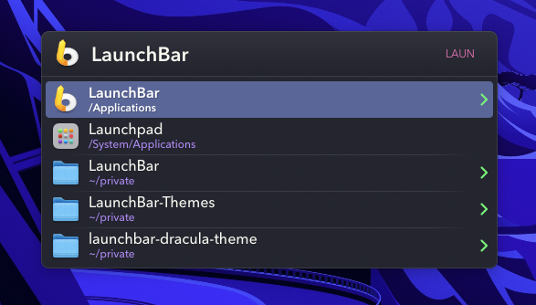

# Dracula Theme for LaunchBar
This repository contains a [LaunchBar](https://obdev.at/products/launchbar/index.html) theme in the [Dracula](https://draculatheme.com/) style.

## Installation

Open `.lbtheme` file and follow instructions in LaunchBar.

If you want to remove the theme, you can find the installed
`.lbtheme` files in your `~/Library/Application Support/Launchbar/Themes/`
directory.

## Misc
For further theming options and values check out this [gist](https://gist.github.com/atika/1f03d24f2445b7bd08ab)